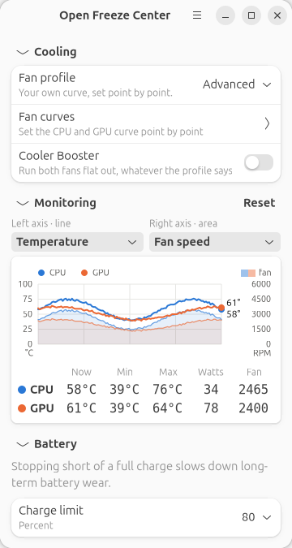
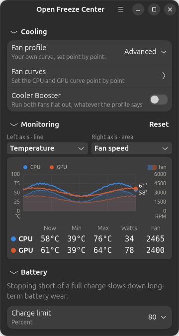
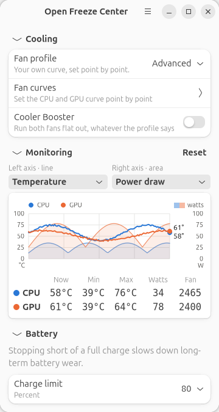
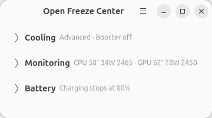
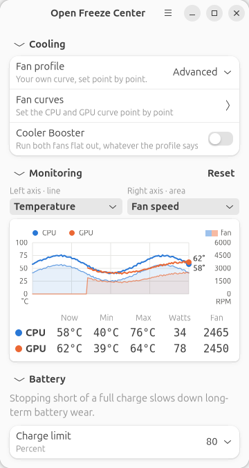
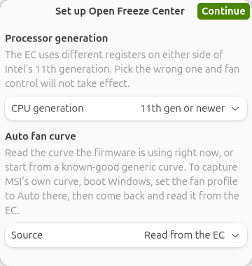
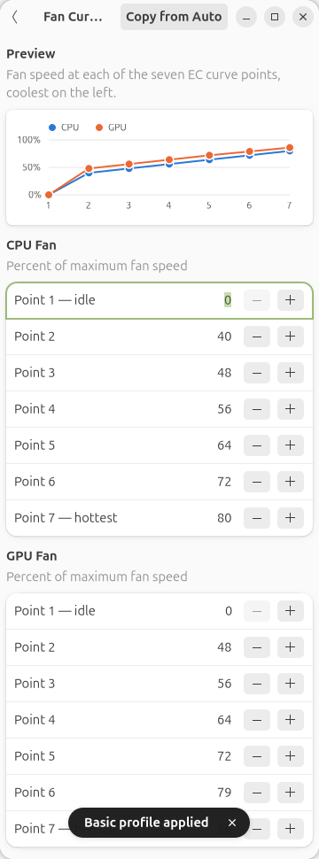
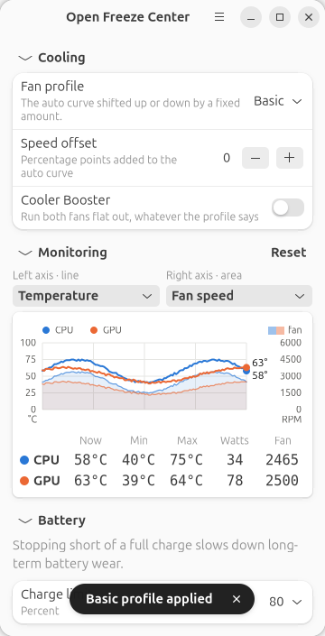
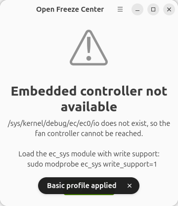

# OpenFreezeCenter (OFC)

Fan profiles, hardware monitoring and battery charge limiting for MSI laptops
on Linux, since MSI ships no Linux client of its own.

| | |
|---|---|
|  |  |

- **Fan profiles** — Auto, Basic (the auto curve shifted by an offset) and
  Advanced (your own curve), plus Cooler Booster as an independent toggle.
- **Fan curve editor** — set all seven CPU and seven GPU points in the app.
- **Live monitoring** — one minute of history for CPU and GPU temperature,
  power draw and fan speed, with the exact current, minimum and maximum below.
- **Choose what the chart plots** — any two of temperature, watts and RPM, one
  against each axis.
- **Battery charge limit** — stop charging between 50% and 100%.

Prefer no GUI at all? [OpenFreezeCenter-Lite](https://github.com/YoCodingMonster/OpenFreezeCenter-Lite)
does the same job from the command line.

## Monitoring

Three quantities are measured, and any two of them can be on the chart at
once — more than two and one of the scales stops meaning anything. The left
axis is drawn as a line, the right as a filled area, and you pick which
measurement goes where:

| Measurement | Where it comes from |
|---|---|
| Temperature | the embedded controller |
| Power draw | Intel RAPL for the CPU, NVML for the GPU |
| Fan speed | the embedded controller |

Colour identifies the chip and nothing else — blue is the CPU, orange the
GPU, on either axis — so a series is placed by its colour and read by its
form. The table underneath always shows **everything**, whatever the chart is
plotting, so choosing the axes never hides a number.



Temperature has a fixed 0–100 °C range, because 100 °C means something. The
power and fan-speed axes have no such natural ceiling, so they are scaled
from the highest value the machine has actually reached, remembered between
sessions. That stored peak only ever grows, so an axis cannot rescale
downwards under a plot you are in the middle of reading.

### Sections fold away

Each section collapses behind its title, and states what it is holding as a
line of text when it does. Closed is a smaller way of seeing the same thing,
not a way of hiding it — and the window takes the height of whatever is on
screen, so folding a section really does make the window smaller.



### A discrete GPU that is asleep

On a laptop with switchable graphics the discrete GPU spends most of its life
powered down. The EC reads a chip that is not running back as zero, which is
not a temperature, so it is shown as `off` rather than plotted as if the GPU
were extremely cold. The lines stop where it slept and pick up where it woke.



Nothing here wakes a sleeping GPU to read from it: the PCI runtime status is
checked first, which costs nothing and does not disturb the device, and NVML
is only reached for when the GPU is already running.

## Requirements

- Python 3.8+, PyGObject, **GTK 4.14 or newer**, **libadwaita 1.4 or newer**
- polkit (for the privilege prompt)
- A kernel with the `ec_sys` module (every mainstream kernel has it)
- Secure Boot disabled, so the module can be loaded
- `sudo`

Power monitoring needs nothing extra installed. CPU watts come from the RAPL
counter in sysfs, and GPU watts from the NVML library the NVIDIA driver
already ships. Either is simply absent — shown as `off` — if the machine has
no counter to read: an AMD GPU, or a kernel without RAPL.

GTK 4.14 is the binding constraint — the charts use the GSK path API added in
that release. In practice that means:

| Distribution | Works? |
|---|---|
| Ubuntu 24.04 LTS and newer | yes |
| Debian 13 (trixie) and newer | yes |
| Fedora 40 and newer | yes |
| Arch, openSUSE Tumbleweed | yes |
| Ubuntu 23.10, Fedora 39 | no — libadwaita is new enough, GTK is not |
| Ubuntu 22.04 LTS, Debian 12 | no — both too old |
| RHEL / Rocky / Alma 9 | no |

`install.sh` checks both versions and stops with an explanation rather than
installing something that would crash on the first redraw.

On anything older, use
[OpenFreezeCenter-Lite](https://github.com/YoCodingMonster/OpenFreezeCenter-Lite),
which has no GUI and therefore no GTK requirement at all.

## Installation

Download and unpack the release, then, **as your normal user**:

```bash
chmod +x install.sh
./install.sh
```

It installs the dependencies, enables EC read/write, and puts the application
in `/opt/openfreezecenter` with a launcher and a desktop entry. Re-run it any
time to update. If the EC could not be enabled without a reboot the script
says so — disable Secure Boot, reboot, then start the app.

To remove everything it installed:

```bash
./install.sh --uninstall
```

## Running

Launch **Open Freeze Center** from your applications menu, or:

```bash
openfreezecenter
```

It asks for your password through polkit, because reading and writing the
embedded controller needs root. So does the CPU power counter — without root
the CPU watts column reads `off`, everything else still works.

To look around the interface on any machine, with no hardware involved:

```bash
openfreezecenter --simulate
```

## First run



Two questions, asked once:

- **Processor generation.** The EC uses different registers on either side of
  Intel's 11th generation. Picking the wrong one means fan control silently
  does nothing — and, on some models, writes a profile value into a register
  that holds a temperature.
- **Auto fan curve.** Read the curve the firmware is using right now, or start
  from a known-good generic one. To capture MSI's own curve, boot Windows, set
  the fan profile to Auto there, then come back and read it from the EC.

You are then offered a one-minute measurement of the fans' top speed, which is
what the RPM axis is scaled from. It is loud, it can be stopped at any point,
and it is in the main menu if you would rather do it later.

## Fan curves



The Advanced profile's seven CPU and seven GPU points, live-previewed. **Copy
from Auto** replaces both curves with the auto profile's, as a starting point.

Basic is simpler: the auto curve shifted up or down by a fixed number of
percentage points.



## Settings

Settings live in `~/.config/openfreezecenter/config.json`, owned by you rather
than root. A `config.py` from an older version is migrated automatically on
first run and left behind as `config.py.migrated`.

The `hardware` section holds the EC register addresses. Only touch it if you
are porting a model that is not listed below — and please open a pull request
if you get one working.

`tools/ec-gpu-probe.py` exists for exactly that. Run it as root and it reports
which EC byte tracks the GPU temperature on your machine, telling apart a
wrong register from a GPU that is merely powered down:

```bash
sudo python3 tools/ec-gpu-probe.py
```

## Upgrading from version 5 or earlier

- Your old `config.py` is imported automatically; nothing to do by hand.
- **Cooler Booster is now a switch, not a fourth profile.** It layers on top of
  whichever profile is selected, so you can leave Advanced set and still boost.
- **Basic now means "the auto curve plus an offset"**, which is what the old
  config comment described. The previous build applied the offset to an
  all-zero curve instead, so Basic drove the fans to roughly the offset value
  at every temperature — near-silent, and much hotter than intended.
- The virtual environment on the Desktop is gone; the app uses the system
  PyGObject. `install.sh --uninstall` does not remove the old `~/Desktop/OFC`
  folder, so delete that yourself once you are happy.

## When the EC cannot be reached



The application says which of the several possible causes it is — the module
not loaded, loaded without write support, or simply not running as root — and
what to do about it, rather than failing silently or crashing.

## Supported laptop models (tested)

- MSI GP76 11UG

## Supported Linux distributions (tested)

- Ubuntu

## Issue format

`ISSUE # [CPU] - [LAPTOP MODEL] - [LINUX DISTRO]`

Example: `ISSUE # i7-11800H - MSI GP76 11UG - UBUNTU 24.04`

## Feedback

Please put suggestions under the Feedback discussion tab.

## Goals

- [X] Fan control GUI
- [X] Temperature and RPM monitoring
- [X] Advanced & Basic GUI control
- [X] Battery threshold
- [X] CPU and GPU power draw
- [X] Choosable chart axes

## AI had been used to do proper documentations, script commenting and assisted in the UI layouts too!
